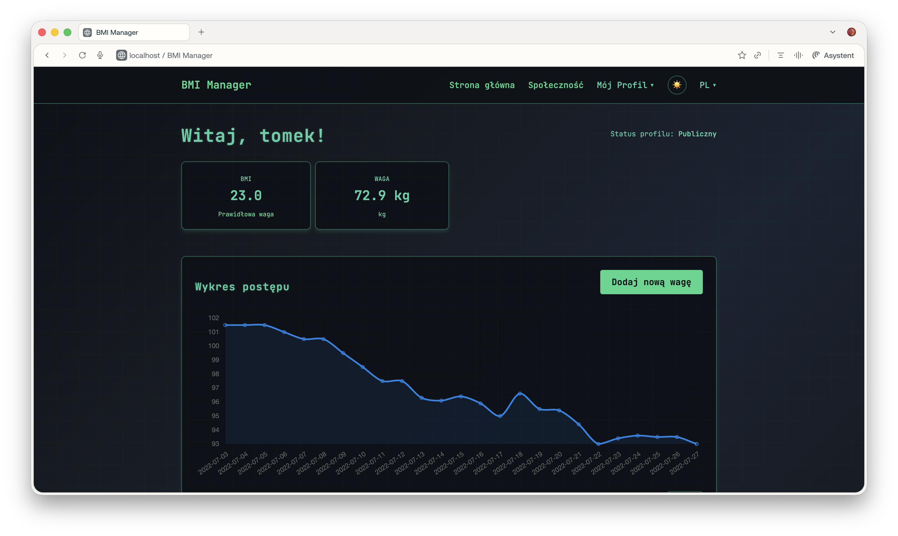

# BMI Manager

## Okładka projektu



## Opis projektu

**BMI Manager** to intuicyjna aplikacja internetowa stworzona dla osób pragnących w świadomy sposób kontrolować swoją masę ciała.

**Wskaźnik BMI** to matematyczny wzór, który na podstawie proporcji między wagą i wzrostem osoby pozwala określić, w którym przedziale kategorii wagowych (m.in. niedowaga, norma, nadwaga, otyłość) klasyfikuje się użytkownik. 

**Funkcjonalność aplikacji** opiera się na prostym i przejrzystym kokpicie, gdzie każdy użytkownik może rejestrować codzienne wyniki wagi, śledzić postępy za pomocą generowanych dynamicznie wykresów, udostępniać swój profil innym oraz przeglądać statystyki wbudowane w panel. Umożliwiono także możliwość przeglądania udostępnionych profili publicznych oraz funkcje zarządzania platformą z poziomu administratora. 

## Uruchomienie projektu

```bash
mvn spring-boot:run
```

Aplikacja będzie gotowa do użycia pod adresem: `http://localhost:8080/`

## Technologie użyte w projekcie

- Java 21
- Maven 3
- Spring Boot
- Spring Security
- Spring Data JPA (Hibernate)
- H2 Database
- Thymeleaf
- HTML, CSS, JavaScript

## Dalsze etapy rozwoju

+ Dodać testy jednostkowe.
+ Dodać tesy integracyjne.
+ Dodać testy akceptacyjne.
+ Dodać scenariusze testowe dla testera manualnego.

## Autor

Tomasz Gądek
